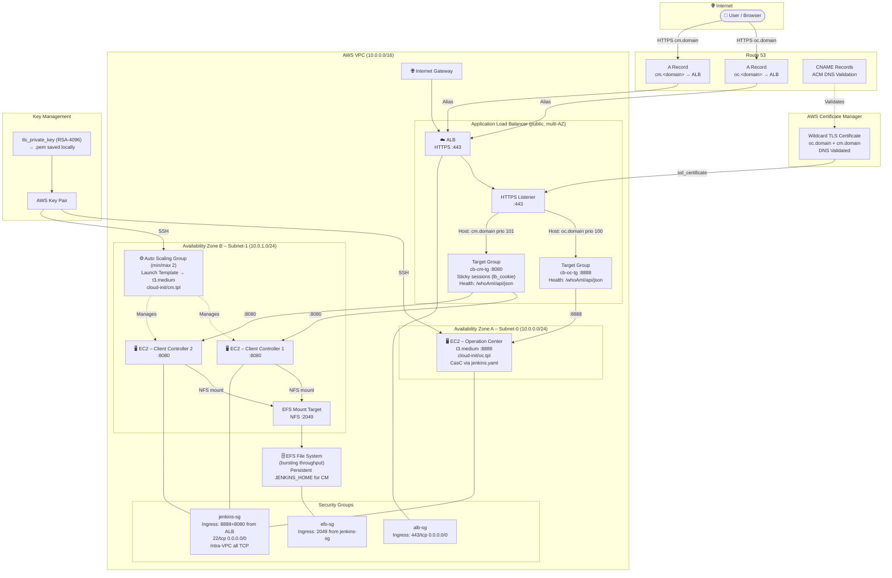

# Terraform Module for Creating Cloudbees CI Operation Center and Client Controller in AWS EC2

# Overview

This Terraform module is designed to deploy Cloudbees CI Operation Center and Client Controller on AWS EC2 instances. It provides a flexible and customizable setup for running Cloudbees CI in a cloud environment.

# Features

- Deploys Cloudbees CI Operation Center on AWS EC2 instances.
- Deploys Cloudbees CI Client Controller on AWS EC2 Auto Scaling Group.
- Automatically generate ec2 key pair for accessing the EC2 instances.
- Automatically configures security groups.
- Automatically install wildcard license file (`license.key` and `license.cert`).
- Automatically configures VPC and subnet configurations.
- Automatically configure ALB for Operation Center and Client Controller.

# Requirements

- AWS account with necessary permissions to create EC2 instances, security groups, and VPCs.
- Predefined hosted zone in Route53 for DNS configuration.
- Terraform installed on your local machine or CI/CD environment.
- Cloudbees CI license file (`license.key` and `license.cert`) placed in the `secrets` directory.
- Terraform version 0.12 or higher.
- AWS provider version 3.0 or higher.

# Usage

- Copy .auto.tfvars.example to .auto.tfvars and fill in the required variables.
- Create hosted zone in Route53 for DNS configuration. and update the .auto.tfvars file
- Copy wildcard license file (`license.key` and `license.cert`) to the `secrets` directory.
- Run `terraform init` to initialize the module.
- Run `terraform plan` to see the execution plan.
- Run `terraform apply` to create the resources defined in the module.
- Run `terraform destroy` to remove the resources created by the module.

# Verify

List resources that have been created (see also default tags in `.auto.tfvars`)

```
aws resourcegroupstaggingapi get-resources \
  --tag-filters Key=cb-user,Values=<YOUR_USRENAME> \
  --region <YOUR_REGION>
```

```
aws resourcegroupstaggingapi get-resources \
  --tag-filters Key=cb-environment,Values=<YOUR_ENVIRONMENT> \
  --region  <YOUR_REGION>
```

# Connect

```
ssh -i "<YOUR_LOCAL_PEM>.pem" ec2-user@ec2-<YOUR_INSTANCE>.compute-1.amazonaws.com
```

# Architecture

The diagram below shows the AWS infrastructure provisioned by this Terraform module.



**Key data flows:**

| Path | Protocol | Port |
|------|----------|------|
| User → Route53 → ALB | HTTPS | 443 |
| ALB → Operation Center (OC) | HTTP | 8888 |
| ALB → Client Controller (CM) | HTTP | 8080 |
| CM instances → EFS | NFS | 2049 |
| Admin → EC2 (SSH) | SSH | 22 |

**Component summary:**

| Component | Resource | Count |
|-----------|----------|-------|
| VPC | `aws_vpc` | 1 |
| Public Subnets | `aws_subnet` | 2 (multi-AZ) |
| Internet Gateway | `aws_internet_gateway` | 1 |
| Application Load Balancer | `aws_lb` | 1 (shared) |
| Operation Center EC2 | `aws_instance` | 1 (t3.medium) |
| Client Controller ASG | `aws_autoscaling_group` | 1 (min/max 2) |
| EFS File System | `aws_efs_file_system` | 1 |
| ACM TLS Certificate | `aws_acm_certificate` | 1 (DNS validated) |
| Route53 Records | `aws_route53_record` | 2 + validation CNAMEs |

---

# TODOS

- [ ] Add Agent VM (SSH)
- [ ] Connect Agent VM to Controller (Permanent SSH Agent)
- [ ] Add test Jobs/scripts and scenarios
- [ ] CasC Items review
